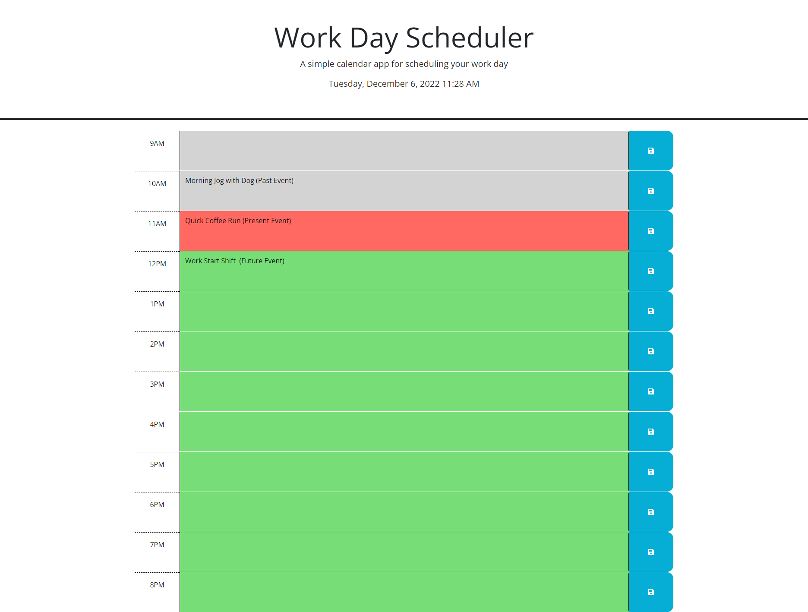

# weekday-schedule
## Description
<H4>I created a simple calendar application that allows a user to save events for each hour of the day.</H4>
<li>This app will run in the browser and feature dynamically updated HTML and CSS powered by jQuery.</li>
<li>Applied acceptance criteria provided.</li>
<li>Created a new repository on my GitHub account and cloned it to computer.</li>
<li>Deployed project using git commands and pushed completed code to my GitHub repository.</li>

## Link To Deployed Project/Application
https://juliennejulien.github.io/weekday-schedule/  

## Visuals

https://user-images.githubusercontent.com/117052258/206001481-680834bd-77b8-4a4e-a1ab-e61cfc6d2965.mp4
